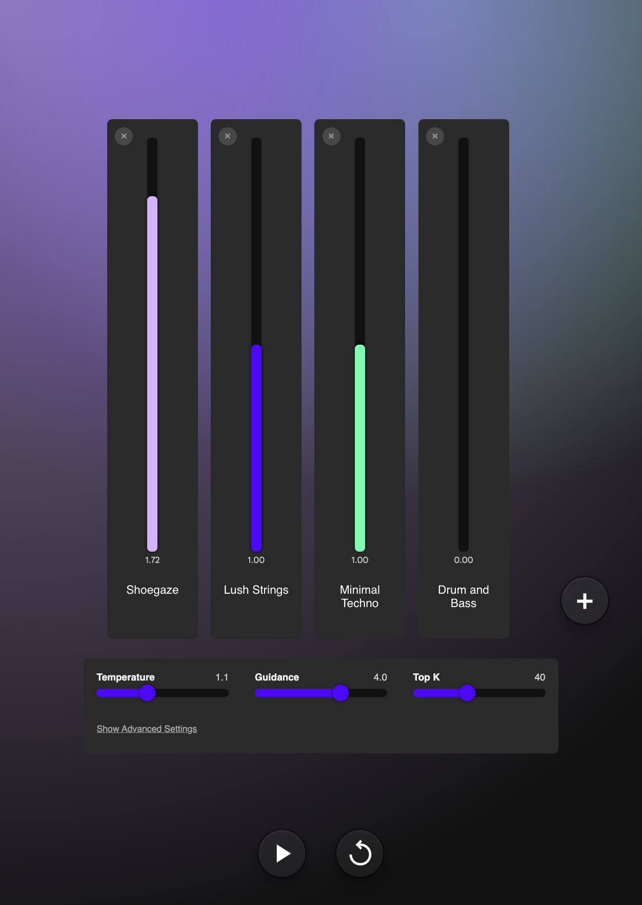

# 🎧 PromptDJ


> **PromptDJ** is a creative tool for mixing, managing, and remixing AI prompts with a DJ-inspired interface. Drag, drop, and blend your favorite prompts to create the perfect AI "set" for your workflow!

---

## 🚀 Features

- 🎚️ **Drag-and-Drop Prompt Mixing**  
  Seamlessly blend and reorder prompts with an intuitive interface.

- 🎨 **Creative Remixing**  
  Combine, edit, and experiment with prompts to find the best results.

- 💾 **Persistent Storage**  
  Your prompt sets are saved locally for easy access and reuse.

- ⚡ **Lightning Fast**  
  Built with modern web technologies for a smooth experience.

---

## 🖥️ Preview

  
<sub>*A sneak peek at the PromptDJ interface*</sub>

---

## 🛠️ Getting Started

### Prerequisites

- [Node.js](https://nodejs.org/) (v16+ recommended)
- [npm](https://www.npmjs.com/) or [yarn](https://yarnpkg.com/)

### Installation

```bash
git clone https://github.com/yourusername/promptdj.git
cd promptdj
npm install
```

### Running Locally

```bash
npm start
```

Open [http://localhost:3000](http://localhost:3000) to view it in your browser.

---

## 📦 Project Structure

```
src/
  ├── components/    # React components
  ├── assets/        # Images and static files
  ├── index.css      # Global styles
  └── App.js         # Main app entry
```

---

## ✨ Usage

1. **Add Prompts:**  
   Click the "+" button to add new prompts.

2. **Mix & Match:**  
   Drag prompts up or down to reorder. Combine prompts for creative results.

3. **Save Your Set:**  
   Your prompt mixes are saved automatically.

---

## 🤝 Contributing

Contributions are welcome! Please open issues and pull requests to help improve PromptDJ.

1. Fork the repo
2. Create your feature branch (`git checkout -b feature/YourFeature`)
3. Commit your changes (`git commit -am 'Add new feature'`)
4. Push to the branch (`git push origin feature/YourFeature`)
5. Open a Pull Request

---

## 📄 License

This project is licensed under the MIT License. See [LICENSE](LICENSE) for details.

---

## 🙏 Acknowledgements

- Inspired by DJ mixing interfaces and the creative AI community.
- Built with ❤️ using React.

---

> _"Mix your prompts like a DJ mixes tracks. Unleash your creativity with PromptDJ!"_
